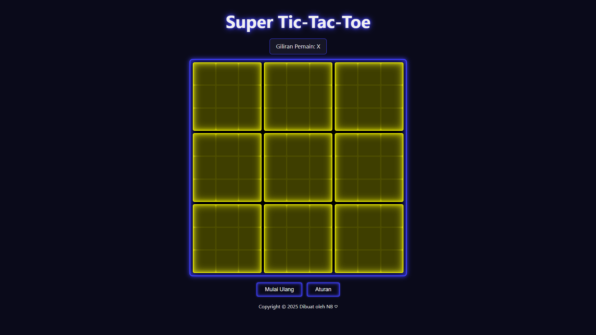

# Super Tic-Tac-Toe (Neon) 🎮

Ini adalah implementasi web dari game klasik "Super Tic-Tac-Toe" (juga dikenal sebagai Ultimate Tic-Tac-Toe). Dibuat dengan desain neon yang modern, responsif untuk seluler, dan dilengkapi dengan AI sederhana.

*(Catatan: Ganti `screenshot.png` dengan nama file screenshot Anda sendiri)*

---

## ✨ Fitur Utama

* **Desain Neon Modern:** Tampilan visual yang cerah dengan efek *glow* yang terinspirasi dari gaya neon.
* **Responsif Penuh:** Dapat dimainkan dengan nyaman di desktop maupun perangkat seluler.
* **Mode Permainan Ganda:**
    * **2 Player:** Bermain melawan teman di satu perangkat.
    * **Lawan AI:** Tantang komputer (AI dengan logika medium).
* **Efek Suara:** Suara *click*, *win*, *lose*, dan *draw* untuk pengalaman yang lebih imersif (membutuhkan file audio eksternal).
* **Aturan Permainan:** Panel aturan yang jelas muncul secara otomatis sebelum permainan dimulai.

---

## 📜 Cara Bermain

1.  Permainan ini adalah Tic-Tac-Toe di dalam Tic-Tac-Toe. Terdapat 9 papan kecil di dalam 1 papan besar.
2.  Untuk memenangkan permainan besar, Anda harus memenangkan 3 papan kecil dalam satu baris (horizontal, vertikal, atau diagonal).
3.  **Aturan Kunci:** Sel mana yang Anda pilih di papan *kecil* (misal: sel kiri-atas) akan menentukan ke papan *besar* mana lawan Anda harus bermain selanjutnya (yaitu papan besar kiri-atas).
4.  Papan besar yang aktif akan ditandai dengan sorotan (highlight) kuning.
5.  Jika papan besar yang dituju sudah dimenangkan atau seri, lawan boleh memilih bermain di papan besar *mana saja* yang masih aktif.

---

## 🚀 Instalasi & Menjalankan

Proyek ini adalah situs web statis murni. Tidak diperlukan server atau proses *build*.

1.  **Clone repositori** ini atau unduh file-filenya.
2.  **Buat folder `sounds/`** di direktori yang sama dengan `index.html`.
3.  Tempatkan file audio Anda di dalam folder `sounds/` dengan nama berikut:
    * `click.wav` (atau `.mp3`)
    * `win.wav` (atau `.mp3`)
    * `lose.wav` (atau `.mp3`)
    * `draw.wav` (atau `.mp3`)
    *(Jika Anda menggunakan format lain seperti `.mp3`, pastikan untuk memperbarui nama file di dalam `script.js`)*
4.  **Buka file `index.html`** di browser favorit Anda.
5.  Selesai!

---

## 📂 Struktur File
/ ├── index.html (Struktur utama HTML) ├── style.css (Semua style neon dan layout responsif) ├── script.js (Logika game, state, AI, dan audio) └── sounds/ ├── click.wav ├── win.wav ├── lose.wav └── draw.wav
---

## 🛠️ Teknologi yang Digunakan

* **HTML5**
* **CSS3** (Grid, Flexbox, Variabel, Efek `box-shadow` & `text-shadow`)
* **JavaScript (ES6+)** (Manipulasi DOM, `Audio()` API, Logika AI)